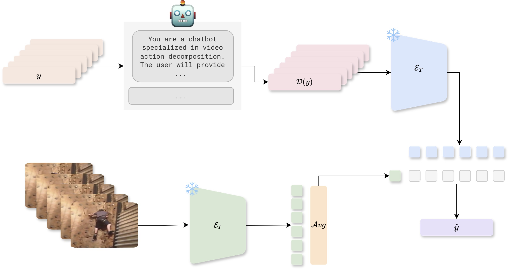

<div align="center">
<a href="https://pytorch.org/get-started/locally/"></a>
<a href="https://pytorchlightning.ai/"></a>
<a href="https://hydra.cc/"></a>
<a href="https://github.com/ashleve/lightning-hydra-template"></a><br>
</div>
<div align="center">
<h1>TEAR:  Text-Enhanced Zero-Shot Action Recognition</h1>
<div>
    Massimo Bosetti</a><sup>1</sup> 
    <a href='https://scholar.google.co.uk/citations?hl=en&user=ZbA-z1cAAAAJ&view_op=list_works&sortby=pubdate' target='_blank'>Shibingfeng Zhang</a><sup>3</sup> 
    <a href='https://scholar.google.com/citations?user=UhOIjIwAAAAJ&hl=en&oi=ao' target='_blank'>Benedetta Liberatori</a><sup>1</sup> 
    <a href='https://scholar.google.com/citations?hl=en&user=KvwYqUUAAAAJ' target='_blank'>Giacomo Zara</a><sup>1</sup> 
    <a href='https://scholar.google.it/citations?user=K1goGQ4AAAAJ&hl=it&oi=ao' target='_blank'>Paolo Rota</a><sup>1</sup>&emsp;
    <a href='https://scholar.google.com/citations?hl=en&user=xf1T870AAAAJ' target='_blank'>Elisa Ricci</a><sup>1,2</sup> 
</div>
<div>
    <sup>1</sup>University of Trento, IT&emsp;- 
    <sup>2</sup>Fondazione Bruno Kessler (FBK), IT&emsp; - 
    <sup>3</sup>University of Bologna, IT
</div>

<br>

<div align="left">

> **Abstract:** Vision-language models (VLMs) have demonstrated remarkable performance across various visual tasks,
leveraging joint learning of visual and textual representations. While these models excel in zero-shot image tasks,
their application to zero-shot video action recognition (ZSVAR) remains challenging due to the dynamic and temporal
nature of actions.
Existing methods for ZS-VAR typically require extensive training on specific datasets, which can be resource-intensive
and may introduce domain biases.
In this work, we propose **T**ext-**E**nhanced **A**ction **R**ecognition (TEAR), a simple approach to ZS-VAR that is training-free and does not require the availability of training data or extensive computational resources. Drawing inspiration from recent findings in vision and language literature, we utilize action descriptors for decomposition and contextual information to enhance zero-shot action recognition. 
Through experiments on UCF101, HMDB51, and Kinetics-600 datasets, we showcase the effectiveness and applicability of our proposed approach in addressing the challenges of ZS-VAR.

## To start

```bash
# clone project
git clone https://github.com/MaXDL4Phys/tear.git
cd tear
```
```
# create envirnmente and install requirements

conda create --name tear python=3.9
conda activate tear
pip install -r requirements.txt
```
Then goes to https://github.com/openai/CLIP to install CLIP according to the instructions.

## Dataset Downloading and Preparation
This Python script extracts frames from videos in a dataset (like UCF101, HMDB51, or K600)
and saves them as images, while also handling directory creation and management.
### UCF101

The code is a Python command to extract frames from the 
"ucf101" dataset, specifying paths for input and output.
```
# Download the dataset from https://www.crcv.ucf.edu/data/UCF101/UCF101.rar, then unzip the file
#extract frames from videos
cd language_driven_action_recognition_localization/src/utils
python extract_frames.py --input <the path to downloaded dataset> --output <where you want to save the extracted frames> --dataset=ucf101
```
### HMDB51
The code is a Python command to extract frames from the 
"hmdb51" dataset, specifying paths for input and output.
```
#Download the dataset from https://serre-lab.clps.brown.edu/resource/hmdb-a-large-human-motion-database/, then unzip the file
#extract frames from videos
cd language_driven_action_recognition_localization/src/utils
python extract_frames.py --input <the path to downloaded dataset> --output <where you want to save the extracted frames> --dataset=hmdb51
```
### KINETICS 600
#### Kinetics-600 Download:

##### Clone repo and enter directory
```
git clone https://github.com/cvdfoundation/kinetics-dataset.git
cd kinetics-dataset
```
##### Download tar gzip files
This will create two directories, k600 and k600_targz. Tar gzips will be in k600_targz, you can delete k600_targz directory after extraction.
```
bash ./k600_downloader.sh
```
##### Extract tar gzip files
To extract the validation videos in folder related to classes use the script k600_video_extractor.sh. This script will extract the videos in the folder related to the classes.
```
bash ./k600_video_extractor.sh
```
##### Extract frames
```
cd language_driven_action_recognition_localization/src/utils
python extract_frames.py --input <the path to downloaded dataset> --output <where you want to save the extracted frames> --dataset=k600
#Create symbolic link to the folder where extracted images are saved at language_driven_action_recognition_localization/data
```


## Experiments

### UCF101
```
python scripts/zsacr-ucf101-run.py
```
### HMDB51
```
python scripts/zsacr-hmdb51-run.py
```
#### HMDB51 Llama
```
python scripts/zsacr-hmdb51-run.py
```


### KINETICS 600
```
python scripts/zsacr-k600-run.py
```
